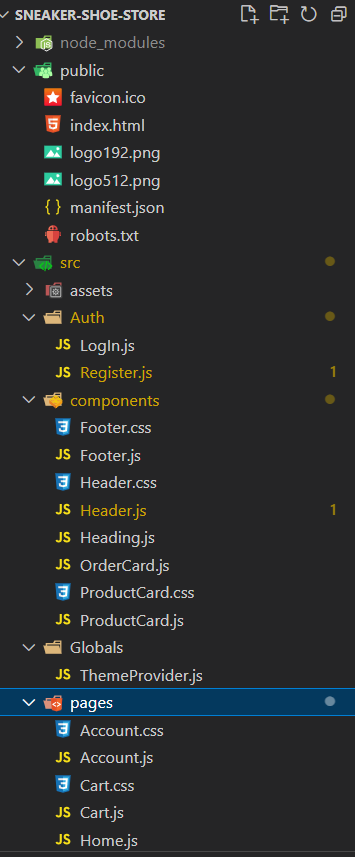
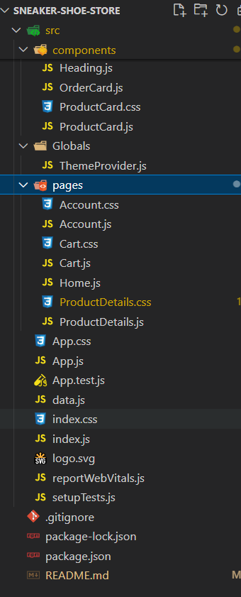

# Sneaker Store

Sneakers Store is an e-commerce web application built with React.js and Bootstrap. The application allows users to browse, search, and purchase sneakers.

## Table of Contents

- [Features](#features)
- [Installation](#installation)
- [Usage](#usage)
- [Folder Structure](#folder-structure)
- [Dependencies](#dependencies)
- [Contributing](#contributing)
- [License](#license)
- [Author](#author)

## Features

- **Browse Products:** View a collection of sneakers.
- **Product Details:** View detailed information about each sneaker.
- **Shopping Cart:** Add sneakers to your shopping cart.
- **User Account:** Manage your user account and view order history.
- **Search Functionality:** Search for specific sneakers.
- **Theme Management:** Toggle between light and dark themes.
- **Responsive Design:** Optimized for desktop and mobile devices.

## Installation

To get started with the project, follow these steps:

1. **Clone the repository:**

   ```sh
   git clone https://github.com/ravindra-maram/sneaker-shoe-store.git
   cd sneakers-store
   ```

2. **Install dependencies:**

   ```sh
   npm install
   ```

3. **Start the development server:**

   ```sh
   npm start
   ```

   The application will be available at `http://localhost:3000`.

## Usage

### Home Page

Browse and search for sneakers. The home page displays a list of available sneakers with options to view details and add them to the cart.

### Product Details

Click on a sneaker to view detailed information, including a larger image, price, and description. You can add the sneaker to your cart from this page.

### Cart

View the sneakers you have added to your cart. Update quantities or remove items. Proceed to checkout from this page.

### Account

Manage your user account. View your order history and update account details.

### Theme Management

Toggle between light and dark themes using the theme switcher in the header.

## Folder Structure

The project has the following structure:
Solarized dark | Solarized Ocean
:-------------------------:|:-------------------------:
 | 

## Dependencies

The project uses the following major dependencies:

- **React:** A JavaScript library for building user interfaces.
- **React Bootstrap:** Bootstrap components built with React.
- **React Router:** Declarative routing for React applications.
- **React Use Cart:** A library for managing cart state.
- **Lightbox Component:** A lightbox component for displaying images.
- **React Icons:** Popular icons in React.

## Contributing

Contributions are welcome! Please fork the repository and submit a pull request with your changes. Make sure to follow the project's code style and include tests for new features and bug fixes.

## License

This project is licensed under the MIT License - see the [LICENSE](LICENSE) file for details.

## Author

&copy; All Rights Reserved By **Ravindra Reddy Maram** ⚡
